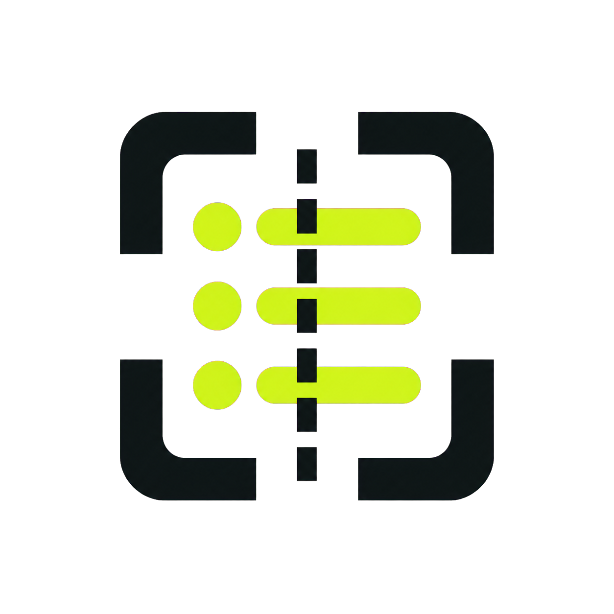

<p align="center">
  
</p>

# dotenv.ai

Catch secrets before they escape.

`dotenvai` is an open-source, private-by-default scanner for code changes. It scans
only added diff lines, reports where a likely credential appeared, and never prints
the matched value.

Detection combines Gitleaks' 200+ maintained provider fingerprints with
dotenv.ai-specific contextual checks for suspicious environment assignments.

## Agent transcript audit

Find credentials retained in local AI coding-agent session history:

```sh
dotenvai audit
dotenvai audit --agent claude --agent codex
dotenvai audit --format json
```

The audit discovers Claude Code, Codex, OpenCode, and Cursor history in their
platform-default locations. It scans locally, opens SQLite histories read-only,
and reports fingerprints and locations without printing matched values.

## CLI

Build it:

```sh
go build -o dotenvai ./cmd/dotenvai
```

Scan staged changes before committing:

```sh
./dotenvai scan --staged
```

Scan a pull-request range:

```sh
./dotenvai scan --base origin/main --head HEAD
```

Machine-readable and GitHub annotation output are built in:

```sh
./dotenvai scan --staged --format json
./dotenvai scan --staged --format github --fail-on high
```

Add `dotenvai:allow` to a line to suppress an intentional fixture. Keep a reason
beside the suppression so reviewers can evaluate it.

Exit codes are `0` for a clean or non-blocking scan, `1` for a usage/runtime error,
and `2` when findings meet the configured failure threshold.

## GitHub Action

The repository is itself a Docker action. Pull requests must be checked out with
full history so the base commit is available:

```yaml
name: secrets
on: pull_request
permissions:
  contents: read
jobs:
  scan:
    runs-on: ubuntu-latest
    steps:
      - uses: actions/checkout@v4
        with:
          fetch-depth: 0
      - uses: dotenvai/dotenvai@v1
        with:
          base: ${{ github.event.pull_request.base.sha }}
          head: ${{ github.event.pull_request.head.sha }}
          fail-on: high
```

Findings appear as inline workflow annotations. Detected values are not written to
logs or artifacts.

## Development

```sh
go test ./...
go vet ./...
docker build -t dotenvai-action .
```

See [the product boundary](docs/product.md).

Third-party licenses and attribution are recorded in
[THIRD_PARTY_NOTICES.md](THIRD_PARTY_NOTICES.md).
